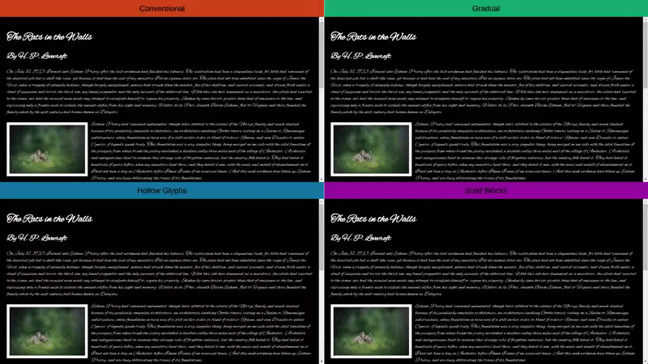

# Invisible Ink

Gradually loading web fonts.


## Application

Create fallback web fonts to protect contents from jumping during initial page load.

The idea is that text rendered using placeholder fonts remains hidden while taking up exactly the same amount of space as when the original web font is used, so once it finishes loading and the text gets rendered with a new font, not a single pixel gets shifted.

This is a purely HTML+CSS approach to combating [FOUT](https://css-tricks.com/fout-foit-foft/).


## See for yourself!

Within the `example` directory you’ll find a basic demo. Don’t open `index.html` directly, but rather run `make demo` and then open http://localhost:5703.

]


## How to install on your system

    npm i -g invisible-ink


## How to use in your project

1. `invisible-ink My-Font-Name.ttf > output.css`
2. Change all
    ```CSS
    font-family: "My Font Name", …;
    ```
    in your code to
    ```CSS
    font-family: "My Font Name", "My Font Name Placeholder", …;
    ```
3. Add this CSS rule:
    ```CSS
    #invisible-ink {
        font-family: "My Font Name Placeholder";
    }
    ```
    and this HTML code:
    ```HTML
    <span id="invisible-ink"></span>
    ```
    to your page.
4. Prepend contents of `output.css` to your project’s CSS codebase.
5. Get rid of `output.css` <sub>…you filthy animal</sub>


## Motivation

Web fonts get loaded asynchronously. The good news is that it doesn’t block the rest of the page from being loaded (unlike JavaScript). The bad news is that there’s always a chance that the CDN where your favorite font lives is just not as fast as you’d like it to be, and the font available on your system will take up different amount of space than the specified web font, when it loads.


## Future of this project

This’s more of a proof of concept than a final piece of software. In an ideal world there should be a Webpack plug-in to do all this automatically.


## Credits

Sample font “Alex Brush” used for the demo was designed by [Robert E. Leuschke](https://www.typesetit.com/).

All photos shown on the demo’s pages were obtained from [Pexels](https://pexels.com/) and are in the public domain along with the text by [H.P. Lovecraft](https://www.hplovecraft.com/).


## License

<a href="http://creativecommons.org/publicdomain/zero/1.0/">
    
</a>
<br />
To the extent possible under law, the author(s) have dedicated all copyright related and neighboring rights to this software to the public domain worldwide.
This software is distributed without any warranty.
