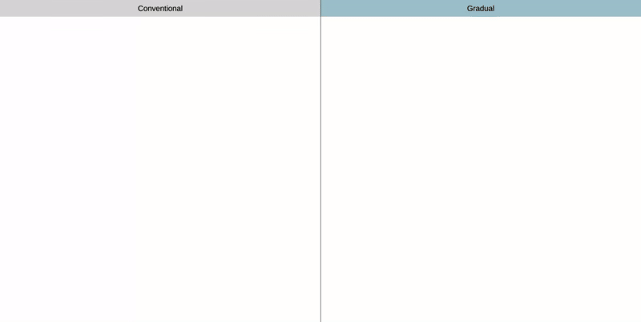

# Invisible Ink

Placeholder web fonts that stop text from jumping while the real font loads.

A placeholder is a copy of your font with every glyph made invisible (or turned into blocks or rough outlines), while everything that decides *where* text goes is kept exactly: advance widths, kerning, ligature rules and vertical metrics. It is small enough to inline in your CSS, so it is there from the first frame. Text is laid out with the placeholder, and when the real font arrives, not a single character moves.



| Measured in Chromium, real font arriving 2 s late | Layout shift (CLS) |
|---|---|
| No placeholder (Source Sans 3) | 0.29 (“poor” is anything above 0.25) |
| With an Invisible Ink placeholder | 0.00 |

See it for yourself: run `make serve` and open http://localhost:5703


## Use it with Vite, SvelteKit, webpack, Next.js…

Install it:

    npm i -D invisible-ink

Add the PostCSS plugin. **Vite and SvelteKit** pick up `postcss.config.js` automatically:

```JS
// postcss.config.js
import invisibleInk from "invisible-ink/postcss";

export default {
    plugins: [invisibleInk()],
};
```

**Next.js** (or anything that takes plugin names):

```JS
// postcss.config.js
module.exports = {
    plugins: { "invisible-ink/postcss": {} },
};
```

**webpack**: add `require("invisible-ink/postcss")()` to the plugins of `postcss-loader`.

Then mark the fonts that should get a placeholder:

```CSS
@font-face {
    font-family: "Alex Brush";
    src: url("./fonts/AlexBrush-Regular.woff2") format("woff2");
    invisible-ink: hollow;
}

h1 {
    font-family: "Alex Brush", cursive;
}
```

That is all. At build time the plugin

1. creates a placeholder from the font file in `src` (`.woff2`, `.woff`, `.ttf` and `.otf` all work),
2. adds an `@font-face` for `"Alex Brush Placeholder"` with the placeholder inlined, copying `font-weight`, `font-style`, `unicode-range`, `size-adjust` and the other descriptors of the original,
3. puts `"Alex Brush Placeholder"` right after `"Alex Brush"` wherever the family is used: `font-family`, the `font` shorthand and custom properties like `--font-heading`,
4. adds `font-display: swap` to the original rule if it has no `font-display`, so the browser uses the placeholder instead of hiding text.

No HTML changes are needed. Placeholders are cached in `node_modules/.cache/invisible-ink`, so rebuilds are fast.

### The `invisible-ink` descriptor

| Value | Placeholder glyphs |
|---|---|
| `hollow` | invisible (the default, and the smallest) |
| `blocks` | solid rectangles the size of each glyph |
| `simplified` | rough outlines of the real glyphs; `simplified 30` sets the tolerance (default 50 per 1000 units of em; higher is coarser and smaller) |
| `characters("Hello")` | only these characters get blocks/outlines, everything else stays invisible |
| `filter("./hero-text.txt")` | same, with the characters read from a file (path relative to the stylesheet) |
| `donor("./other.ttf")` | take simplified outlines from another font |
| `no-layout` | drop kerning and other layout tables: smaller, but text no longer lines up exactly |
| `none` | no placeholder (useful with the `all` option) |

Values combine: `invisible-ink: simplified 40 filter("./headline.txt");`

### Plugin options

```JS
invisibleInk({
    glyphs: "hollow",        // default mode for rules that don't say
    all: false,              // true: process every @font-face, not only marked ones
    families: [],            // family names to rewrite in stylesheets processed before
                             //   the one with their @font-face (see below)
    fontDisplay: "swap",     // set on original rules without font-display; false to leave alone
    root: undefined,         // where "/fonts/x.woff2" urls point; defaults to ./public or ./static
    resolve: undefined,      // (url, fromFile) => path, for aliases like "$lib/fonts/x.woff2"
    cache: undefined,        // cache directory, or false
    warnSize: 32768,         // warn when a placeholder is bigger than this (bytes)
});
```

The plugin remembers the families it has seen, so usages in one stylesheet are rewritten after the `@font-face` has been processed in another. If a stylesheet using a family can be processed first (in some setups, component styles), list the family in `families`.


## Placeholder size

The placeholder keeps the font's layout tables, because those decide where text goes. For a font already subset to the scripts a site uses, which is what Google Fonts, Fontsource and most self-hosted setups serve, that is a few kilobytes:

| Font | Font file | Hollow placeholder (WOFF2) |
|---|---|---|
| Alex Brush (Latin) | 49 KB TTF | 2.4 KB |
| KaTeX Main | 26 KB WOFF2 | 2.4 KB |
| Source Sans 3, *full*, 2,478 glyphs | 154 KB WOFF2 | 52 KB (12 KB with `no-layout`) |

If the plugin warns that a placeholder is large, subset the font (e.g. with `pyftsubset` or `glyphhanger`), or split it with `unicode-range`. Use `no-layout` only if the font barely kerns: dropping kerning is exactly what makes text move.

`simplified` placeholders cost more than `hollow` ones (Alex Brush: 12 KB), so they suit display fonts used for a few lines; combine them with `characters()` or `filter()` to outline only a headline.


## Command line

    npm i -g invisible-ink
    invisible-ink [options] My-Font.woff2 > placeholder.css

| Option | |
|---|---|
| `-b`, `--blocks` | solid blocks |
| `-s`, `--simplified` | simplified outlines |
| `-f`, `--filter <file>` | only draw characters found in this file (simplified, or blocks with `-b`) |
| `-d`, `--donor <font>` | take outlines from another font (`-b` fills in glyphs it lacks) |
| `-t`, `--tolerance <n>` | simplification tolerance (default 50) |
| `--format <format>` | `woff2` (default) or `truetype` |
| `--no-layout` | drop kerning and other layout tables |

Then add `"My Font Placeholder"` after `"My Font"` in your `font-family` lists, and prepend `placeholder.css` to your styles.


## Library

```JS
const { createPlaceholderFont, composeCSSFontFaceDefinition } = require("invisible-ink");

const placeholder = createPlaceholderFont(fs.readFileSync("My-Font.woff2"), {
    glyphs: "hollow",          // "hollow" | "blocks" | "simplified"
    characters: null,          // string, array of code points or Set
    tolerance: 50,
    donor: null,               // Buffer of another font
    missing: "hollow",         // what to draw when the donor lacks a glyph: "hollow" | "blocks"
    layout: true,
    format: "woff2",           // or "truetype"
});
// → { familyName, sourceFamilyName, weight, style, format, data, glyphCount, visibleGlyphCount }

const css = composeCSSFontFaceDefinition(placeholder.familyName, placeholder.format, placeholder.data);
```

The 1.x function `createFontBuffer()` still works but is deprecated.


## How it works

Earlier versions rebuilt a new font from the glyphs, which lost kerning and recomputed vertical metrics, so text could still shift. Measured in Chromium against the real fonts:

| | 1.x placeholder | 2.0 placeholder |
|---|---|---|
| Source Sans 3 (kerned) | 250 of 311 characters moved, up to 577 px (lines re-wrapped) | none moved |
| KaTeX Main | every character moved 38 px down (wrong line metrics) | none moved |

Version 2 copies every table of the original font byte for byte (`hmtx`, `hhea`, `OS/2`, `cmap`, `GDEF`, `GPOS`, `GSUB`, `kern`…) and only replaces the outlines (`glyf`, `loca`, `maxp`). Hinting, bitmap and colour tables are dropped. CFF (`.otf`) fonts get TrueType outlines. The `test/layout.regression.test.js` suite checks, in a real browser, that every character lands in exactly the same place.


## Limitations

- Variable CFF2 fonts and font collections (`.ttc`) are not supported. Variable TrueType fonts keep exact layout along every axis (tested with Oswald from 200 to 700), but `blocks` and `simplified` glyphs are drawn from the default instance.
- Remote fonts (`https://…` in `src`) are skipped with a warning; download them into the project.
- With `characters()`/`filter()`, glyphs only reachable through ligatures or alternates stay invisible.
- Vertical metrics are copied as they are, so the placeholder behaves like the real font on every platform; only Chromium on Linux has been tested here.


## Development

    npm install
    npm test

The browser tests use Puppeteer's Chromium; set `CHROME_PATH` to use another build. `make serve` runs the demo in a container, `make help` lists the other targets.


## Motivation

Web fonts get loaded asynchronously. The good news is that they don't block the rest of the page from loading (unlike JavaScript). The bad news is that a font from a slow CDN arrives after the page has been laid out with a fallback font, which takes up a different amount of space, so everything moves.


## Credits

Sample font “Alex Brush” used for the demo was designed by [Robert E. Leuschke](https://www.typesetit.com/).

All photos shown on the demo’s pages were obtained from [Pexels](https://pexels.com/) and are in the public domain along with the text by [H.P. Lovecraft](https://www.hplovecraft.com/).


## License

To the extent possible under law, the author(s) have dedicated all copyright related and neighboring rights to this software to the public domain worldwide.
This software is distributed without any warranty.
